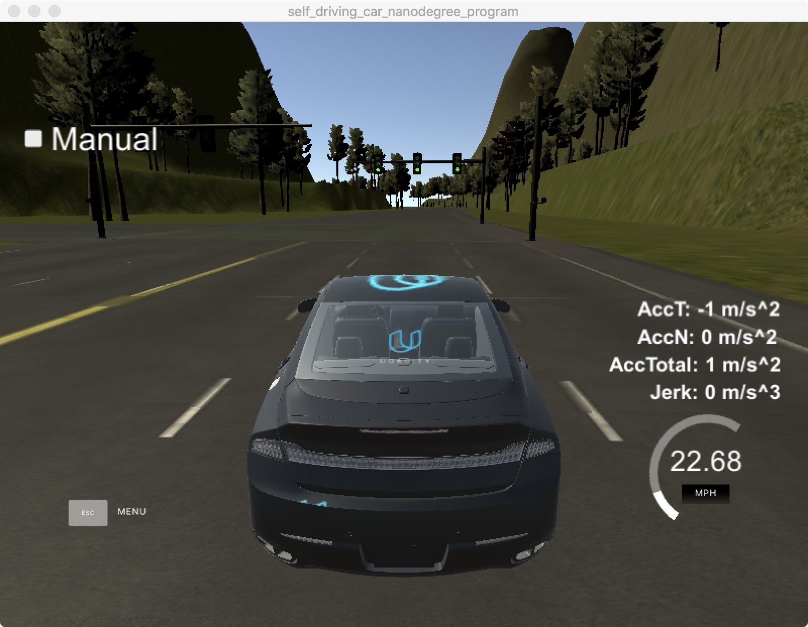
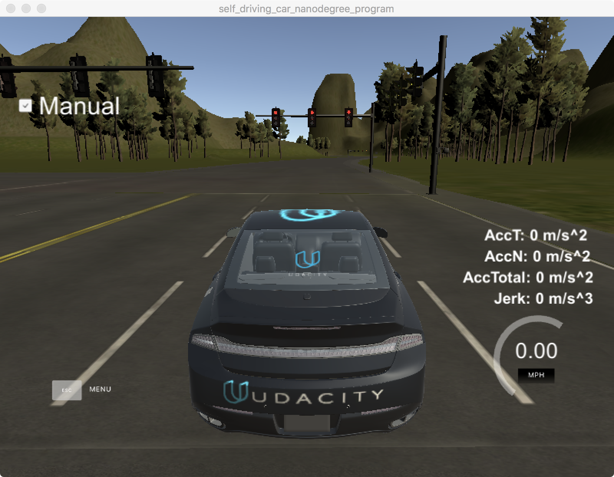
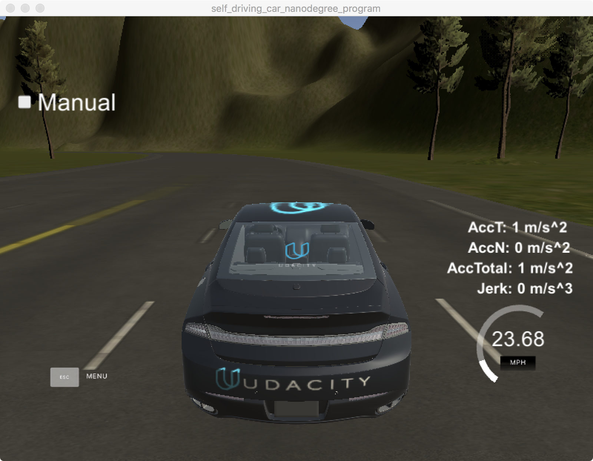

# Team Drive Directive


## Team Lead
Piotr (Peter) Szczesnowicz	szczesnowicz.piotr@gmail.com	UTC-05 (Toronto)

## Members
Name | eMail | Time Zone
------------ | ------------- | -------------
Wade Ju	 | wade_ju@me.com (wadeju@yahoo.com)  | 	UTC-8 (PST)
Jan Grodowski	 | jgrodowski@gmail.com  | 	UTC+1
Christian Reiser	 | reisercg@gmail.com	 | (MEZ)
Cedric Bodet | 	bodetc@gmail.com	 | 	UTC+1/+2

We have implemented Waypoint Updater Node, DBW node, and Traffic Light Detection Node for the project.

### Waypoint Updater Node
This node  subscribes to /base_waypoints, /current_pose, and /traffic_waypoint,
and publishes 200 waypoints with velocities from the current car position to /final_waypoints.

/base_waypoints: list of wwypoints with positions in world coordinate
/current_pose: current car position in world coordinate
/traffic_waypoint: the waypoint index of stop line (traffic light)   

We get maximum velocity from /waypoint_loader/velocity and convert it to unit of meters per second.

When a new /current_pose topic comes in, pose_cb callback is invoked to get an updated position of the car and calculate new waypoints from the updated position. We get next 200 waypoints from the base waypoints and wrapping around if reaching the end.

When a new traffic light topic comes in, traffic_cb callback is invoked to adjust speed. First, we check whether it's a new message to avoid duplication. For red light, we use a distance equal to max speed times five to slow down velocity of the car linearly before a stop line.  

### DBW Node
Once messages are being published by the waypoint updater node to /final_waypoints, the vehicle's waypoint follower will publish twist commands to the /twist_cmd topic, which contains linear and angular velocities.

The drive-by-wire (DBW) node subscribed to the /twist_cmd topic and uses various controllers to provide appropriate throttle, brake, and steering commands 

/vehicle/throttle_cmd
/vehicle/brake_cmd
/vehicle/steering_cmd

DBW uses a PID control to calcualte throttle, brake, steering angle with input of target linear and angular velocity, and the current velocity. Throttle needs to be limited between 0.0 and 1.0. Acceleraion needs to be limited to parameters of decceleraion and acceleration limitations. 

Brake is calculated by the formula of (vehicle mass + fuel capacity * density) * acceleraion * wheel radius.
If brake is less the brake dead band parameter, we simply set it to zero.
Steering angle is calculated by the yaw controller provided by Udacity.

If a safety driver takes over control of the car, DBW node will be disabled.

### Traffic Light Detection Node
The traffic light detection node detects traffic light color from /image_color, an image stream from the car's camera.
The node publishes the index of the waypoint for nearest upcoming red light's stop line to a single topic /traffic_waypoint.
For example, if waypoints is the complete list of waypoints, and an upcoming red light's stop line is nearest to waypoints[12], then 12 should be published through /traffic_waypoint. This index can later be used by the waypoint updater node to set the target velocity for waypoints[12] to 0 and smoothly decrease the vehicle velocity in the waypoints leading up to waypoints[12].

We have gone through three implementaions for this module. First, we implemented it with /vehicle/traffic_lights topic from simulator. It has both color and position of traffic lights. It helped us to develop and test solution.  

Second, we implemented a HSV classifier to detect image of red light. We get poistions of stop lines from the provided config files. When an image comes in, image_cb callback function is invoked to process a image. If the state sustains more three threshold count, we publish waypoint index of the corresponding stop line for red light to /traffic_waypoint. Otherwise, we publish -1 to /traffic_waypoint.

Third, we use a Convolutional Neural Network (CNN) to train and predicate traffic light color.

### Light Detection Classifier
#### HSV classifier
HSV (Hue, Saturation, Value) is better than RGB for this kind of classification.
We define a low and high range of red in HSV.
 RED_MIN = np.array([0, 180, 180], np.uint8)
 RED_MAX = np.array([10, 255, 255], np.uint8)
 THRESHOLD = 60
First, we use OpenCV to convert image from BGR space to HSV space.
img_hsv = cv2.cvtColor(image, cv2.COLOR_BGR2HSV)
Second, we use OpenCV to change how many pixels are in the red range.
	frame_threshed = cv2.inRange(img_hsv, self.RED_MIN, self.RED_MAX)
If it's higher than the threshold, it's a red light. 
	count = cv2.countNonZero(frame_threshed)
        if  (count > self.THRESHOLD):
		return  TrafficLight.RED 
	else:
        	return  TrafficLight.UNKNOWN

#### CNN classifier
TBD

### Images




### Conclusion
It's a good project. 
With ML, it can be extended to compicate traffic lights.
We also need to detect obstacles like pedestrians, bicyles, motercycles, cars, and others.


### The Orignal Readme
This is the project repo for the final project of the Udacity Self-Driving Car Nanodegree: Programming a Real Self-Driving Car. For more information about the project, see the project introduction [here](https://classroom.udacity.com/nanodegrees/nd013/parts/6047fe34-d93c-4f50-8336-b70ef10cb4b2/modules/e1a23b06-329a-4684-a717-ad476f0d8dff/lessons/462c933d-9f24-42d3-8bdc-a08a5fc866e4/concepts/5ab4b122-83e6-436d-850f-9f4d26627fd9).

### Installation 

* Be sure that your workstation is running Ubuntu 16.04 Xenial Xerus or Ubuntu 14.04 Trusty Tahir. [Ubuntu downloads can be found here](https://www.ubuntu.com/download/desktop). 
* If using a Virtual Machine to install Ubuntu, use the following configuration as minimum:
  * 2 CPU
  * 2 GB system memory
  * 25 GB of free hard drive space
  
  The Udacity provided virtual machine has ROS and Dataspeed DBW already installed, so you can skip the next two steps if you are using this.

* Follow these instructions to install ROS
  * [ROS Kinetic](http://wiki.ros.org/kinetic/Installation/Ubuntu) if you have Ubuntu 16.04.
  * [ROS Indigo](http://wiki.ros.org/indigo/Installation/Ubuntu) if you have Ubuntu 14.04.
* [Dataspeed DBW](https://bitbucket.org/DataspeedInc/dbw_mkz_ros)
  * Use this option to install the SDK on a workstation that already has ROS installed: [One Line SDK Install (binary)](https://bitbucket.org/DataspeedInc/dbw_mkz_ros/src/81e63fcc335d7b64139d7482017d6a97b405e250/ROS_SETUP.md?fileviewer=file-view-default)
* Download the [Udacity Simulator](https://github.com/udacity/self-driving-car-sim/releases/tag/v0.1).

### Usage

1. Clone the project repository
```bash
git clone https://github.com/udacity/carnd_capstone.git
```

2. Install python dependencies
```bash
cd carnd_capstone
pip install -r requirements.txt
```
3. Make and run styx
```bash
cd ros
catkin_make
source devel/setup.sh
roslaunch launch/styx.launch
```
4. Run the simulator


